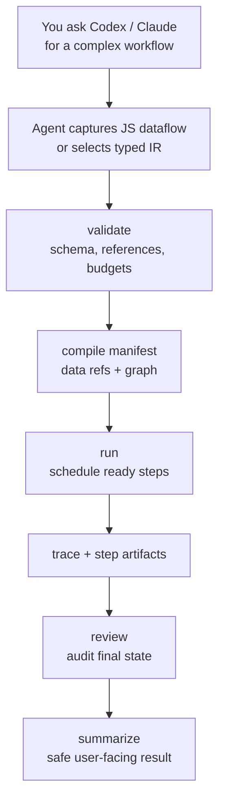

# Dynamic Workflow

JS-first, auditable workflow execution for complex agent work.

Dynamic Workflow gives Codex or Claude a local workflow runtime for tasks that need explicit, reviewable steps and explicit artifact handoff. Instead of asking an agent to "remember the plan", the agent captures or writes a workflow, validates it, compiles it into a manifest, runs it, and leaves durable evidence: manifest, trace, step artifacts, status, review, and summary.

Use it when a task is too large for one prompt and you want proof that every branch, loop, verification command, and final audit actually ran.

## When To Use It

Use Dynamic Workflow for:

- Multi-step implementation or review work that needs a real dependency graph.
- Fan-out review followed by synthesis.
- Conditional workflows, such as classify-and-act or skipped branches.
- Bounded repair loops.
- Candidate tournaments.
- Evidence collection that should preserve partial results even when optional probes miss.
- Verification steps that must run shell commands and fail strictly on broken invariants.
- Auditable experiments where you want `status`, `review`, and `summarize` after execution.

Do not use it for:

- One-off edits or quick questions.
- Work that cannot be expressed as explicit steps.
- Untrusted arbitrary JavaScript execution. The JS harness is compile/capture only in the MVP.
- External agent backends. The MVP backend is `current` only; explicit `codex`, `claude`, `acp`, or remote backend names fail closed.

## How It Works



The important rule: the compiled manifest is the execution contract. Prompt prose can explain intent, but the runtime only executes what validates and compiles. `depends_on` controls scheduling; `consumes` controls which upstream artifact data is injected into downstream context.

## Collect Vs Verify

Use `command.collect` for evidence gathering: repository scans, code snippets, file listings, and exploratory searches. Optional misses are recorded as `collection.gaps`, and downstream review/synthesis steps consume evidence through `consumes`.

Use `command.verify` for required proof: tests, builds, type checks, lint, schema checks, and final acceptance commands. It remains strict by default: a non-zero command exit fails the step unless the plan explicitly declares acceptable exit codes.

Good workflows usually collect evidence early, review/synthesize it with explicit dataflow, then end with one or more strict `command.verify` steps.

## Install

If Dynamic Workflow is already installed as a Codex or Claude skill, skip to the quickstart. The installed skill includes its own runtime under `runtime/`; users do not need to clone this repository.

If you are installing from this repository as a maintainer, the runtime needs Node.js 20 or newer and a local build. The build refreshes the bundled skill runtime:

```sh
npm install
npm run build
```

### Codex

Install the skill by copying the built skill directory:

```sh
mkdir -p ~/.agents/skills
rm -rf ~/.agents/skills/dynamic-workflow
cp -R /path/to/dynamic-workflow/skills/dynamic-workflow ~/.agents/skills/dynamic-workflow
```

Older local Codex setups may also scan `~/.codex/skills`:

```sh
mkdir -p ~/.codex/skills
rm -rf ~/.codex/skills/dynamic-workflow
cp -R /path/to/dynamic-workflow/skills/dynamic-workflow ~/.codex/skills/dynamic-workflow
```

Restart Codex after installing or updating the skill. Symlink installs are useful for local development, but copied installs are the expected user distribution model because all required runtime files live inside the skill directory.

### Claude

Claude users can install with the `.claude-plugin/` manifests when this repo is published through a Claude plugin flow. A copied install should include the same `skills/dynamic-workflow/runtime/` payload.

## Quickstart In Codex Or Claude

After installing the skill, use one product entry: `dynamic-workflow`.

In Codex, explicitly invoke the skill with `$dynamic-workflow` or pick it from `/skills`:

```text
$dynamic-workflow Fix the flaky checkout total calculation.
Reproduce the failure, implement a focused fix, run the relevant test,
then run an adversarial review step before the final command.verify.
```

The agent must complete this sequence in a single user operation: plan -> validate -> compile manifest/risk summary -> run -> status/review/summarize.

Natural-language equivalent:

```text
Use dynamic-workflow to fix the flaky checkout total calculation.
Plan: reproduce the failure, implement a focused fix, run the relevant test,
then run an adversarial review step before the final command.verify.
```

Good fit because the workflow has clear phases: reproduce, fix, verify, review.

When a downstream step needs upstream evidence, ask for explicit dataflow. The agent should prefer JS-first authoring where available:

```js
const docs = command("collect_docs", {
  run: [
    "sed -n '1,220p' README.md",
    "sed -n '1,220p' skills/dynamic-workflow/SKILL.md",
  ],
});

const review = agent.review("review_docs", {
  prompt: "Review README/SKILL/template consistency. Return structured findings.",
  context: {
    docs: docs.output("$.output.collection.checks[*].stdout"),
  },
});

agent.synthesize("summary", {
  prompt: "Summarize the review with evidence.",
  context: {
    findings: review.output("$.output.status"),
  },
});
```

This captures to manifest v2 with `consumes` edges. YAML/JSON typed plans remain supported as an import/export IR and for direct CLI use.

Agent steps also produce typed output contracts. For example, `agent.classify`
writes `artifact.output.label` and `artifact.output.confidence`, while
`agent.review` writes `ok`, `findings`, and `blocking_count`. Downstream steps can
branch or consume those fields directly:

```yaml
- step_id: classify_request
  type: agent.classify
  depends_on: []
  input:
    prompt: Classify the request as feature, bugfix, research, or docs.

- step_id: feature_flow
  type: workflow.include
  depends_on: [classify_request]
  input:
    workflow_ref: builtin.feature
  run_if:
    step: classify_request
    output_path: label
    op: ==
    value: feature
```

Use `input.output_schema` when a step needs extra required fields beyond the
built-in contract. Runtime must fail invalid agent JSON or schema mismatches
instead of letting downstream steps guess from prose.

If your Codex version exposes local custom prompts, the installed compatibility prompt appears as:

```text
/prompts:dynamic-workflow Fix the flaky checkout total calculation.
```

Some hosts may expose a shorter `/dynamic-workflow` alias. The user-facing interface remains one entry; plan, run, status, review, and resume are internal phases.

### Example: Codebase Audit

```text
$dynamic-workflow Review the API gateway, job worker, and database layer for race conditions.
Use three parallel reviewer steps, synthesize findings, then verify by running the test suite.
```

Good fit because fan-out reviewers can inspect different areas independently before a synthesis step removes duplicates.

### Example: Research Task

```text
$dynamic-workflow Compare three approaches for adding offline sync.
Generate candidate designs, run a tournament against correctness/risk/implementation cost,
then synthesize the recommended plan with tradeoffs and open questions.
```

Good fit because `workflow.tournament` records how candidates were compared instead of burying the decision in a single answer.

### Example: Larger Implementation

```text
$dynamic-workflow Migrate the notifications pipeline from polling to event-driven delivery.
Include classify-and-act for unknown risk areas, a bounded repair loop after review findings,
and command.verify steps for unit tests, integration tests, and lint.
```

Good fit because the workflow needs conditional branches, multiple verification gates, and durable status if the run is interrupted.

### Entry Contract

For any of these requests, the agent must:

1. Resolve the skill directory containing `SKILL.md`.
2. Use `<skill_dir>/scripts/dw`, which resolves the bundled runtime at `<skill_dir>/runtime/bin/dw.mjs`.
3. Write or select a typed plan from the skill template, then adapt it to the task.
4. Run `validate`, read any warning lines, and revise brittle command shapes before execution.
5. Run `compile` and show a concise manifest/risk summary, including warnings when present.
6. Continue without another user command through `run`, `status`, `review`, and `summarize`.
7. Stop before execution only when the user explicitly asks for plan-only review.
8. Resolve omitted plan paths and run ids from recent context when unambiguous.
9. Ask one disambiguating question only when multiple recent plans or runs are plausible.

Successful runs print markers like:

```text
DW_RUN_START <run-id>
DW_STEP_START <step-id>
DW_STEP_VERIFY <step-id> succeeded
DW_STEP_DONE <step-id>
DW_REVIEW_START
DW_REVIEW_COMPLETE ok
DW_RUN_COMPLETE
```

## If You Want To Run The CLI Yourself

The skill uses the same CLI directly:

```sh
~/.agents/skills/dynamic-workflow/scripts/dw validate ~/.agents/skills/dynamic-workflow/templates/plan.yaml
~/.agents/skills/dynamic-workflow/scripts/dw compile ~/.agents/skills/dynamic-workflow/templates/plan.yaml
~/.agents/skills/dynamic-workflow/scripts/dw run ~/.agents/skills/dynamic-workflow/templates/plan.yaml
~/.agents/skills/dynamic-workflow/scripts/dw status <run-id>
~/.agents/skills/dynamic-workflow/scripts/dw review <run-id>
~/.agents/skills/dynamic-workflow/scripts/dw summarize <run-id>
~/.agents/skills/dynamic-workflow/scripts/dw resume <run-id>
```

For throwaway experiments, isolate runtime output:

```sh
tmpdir=$(mktemp -d)
~/.agents/skills/dynamic-workflow/scripts/dw run my-plan.yaml --root "$tmpdir/runtime"
```

With `--root <dir>`, runs are written under `<dir>/runs/<run-id>/`. Without it, runtime artifacts default to `.dynamic-workflow/runs/<run-id>/`.

## Plan Shape

A minimal plan:

```yaml
schema_version: dynamic_workflow/run/v1
workflow_id: dwf_example
kind: mixed
steps:
  - step_id: implement
    type: agent.execute
    depends_on: []
    input:
      prompt: "Implement the requested change."

  - step_id: verify_commands
    type: command.verify
    depends_on: [implement]
    verify:
      commands:
        - npm test
```

Important fields:

- `step_id`: stable id used by dependencies and traces.
- `type`: registered step type, such as `agent.review`, `workflow.loop`, `command.collect`, or `command.verify`.
- `depends_on`: explicit step dependencies.
- `consumes`: optional dataflow inputs selected from upstream step artifacts.
- `produces`: optional stable output contract names for a step.
- `run_if`: optional condition evaluated against a previous step's output object.
- `collect.commands`: canonical command list for `command.collect` evidence gathering.
- `verify.commands`: canonical command list for strict `command.verify`.
- `permission_profile`: optional explicit profile; defaults come from the registry.
- `input.resource_scope`: optional lock scope used by conflict detection.

For the complete plan authoring contract, including every supported step type and permission profile, see `skills/dynamic-workflow/references/plan.md`.

Example collection step with a bounded scan:

```yaml
- step_id: collect_python_defs
  type: command.collect
  permission_profile: command_collector
  depends_on: []
  collect:
    commands:
      - id: py_defs
        run: "rg --glob '*.py' --glob '!{.venv,.dynamic-workflow,__pycache__}/**' 'def |class ' ."
        allow_exit_codes: [0, 1]
        soft_fail: true
        timeout_seconds: 30
```

`dw validate` and `dw compile` surface non-blocking warnings for brittle commands, such as broad `rg` scans without excludes, nested shell wrappers, and optional searches placed under strict `command.verify`.

## Supported Workflow Modes

### Fan-out And Synthesize

Run independent review or generation branches, then merge:

```yaml
- step_id: review_gateway
  type: agent.review
  depends_on: []
- step_id: review_runtime
  type: agent.review
  depends_on: []
- step_id: synthesize
  type: agent.synthesize
  depends_on: [review_gateway, review_runtime]
```

Use `consumes` when synthesis should receive upstream artifacts, not just wait for branches:

```yaml
- step_id: synthesize
  type: agent.synthesize
  depends_on: [review_gateway, review_runtime]
  consumes:
    - from: review_gateway
      select: $.output.status
      as: gateway_status
    - from: review_runtime
      select: $.output.status
      as: runtime_status
```

### Adversarial Verification

Follow writer steps with read-only reviewers:

```yaml
- step_id: implement
  type: agent.execute
  depends_on: []
- step_id: adversarial_review
  type: agent.review
  depends_on: [implement]
```

### Classify And Act

Use `run_if` and `workflow.include` for conditional branches:

```yaml
- step_id: classify
  type: agent.classify
  depends_on: []

- step_id: feature_flow
  type: workflow.include
  depends_on: [classify]
  input:
    workflow_ref: builtin.feature
  run_if:
    step: classify
    output_path: label
    op: ==
    value: feature
```

`output_path` is relative to the step output object. For example, `output_path: status` reads the output status field.

### Tournament

Compare candidate steps with pairwise judges:

```yaml
- step_id: tournament
  type: workflow.tournament
  depends_on: [candidate_a, candidate_b, candidate_c]
  input:
    candidate_steps: [candidate_a, candidate_b, candidate_c]
    criteria: [correctness, risk, maintainability]
```

### Bounded Loop

Express iterative repair as bounded rounds:

```yaml
- step_id: repair_loop
  type: workflow.loop
  depends_on: [tournament]
  input:
    max_rounds: 2
    stop_condition: tests_pass
```

### Control Dependencies

Plan authors may depend on original control ids:

```yaml
- step_id: synthesize
  type: agent.synthesize
  depends_on: [repair_loop]
  run_if:
    step: repair_loop
    output_path: status
    op: ==
    value: succeeded
```

The compiler rewrites `repair_loop` to its terminal expanded node, such as `repair_loop__round_2`. The same applies to `workflow.include` and `workflow.tournament`. Compiled manifests fail closed if any `depends_on` or `run_if.step` references a missing node.

## JS Harness

The JS harness is a capture layer, not a Node sandbox. It turns supported SDK-looking calls into a typed plan; it does not execute arbitrary workflow JavaScript.

Supported capture primitives:

- `agent(...)`
- `command(...)`
- `agent.review(...)`
- `agent.synthesize(...)`
- `agent.execute(...)`
- `parallel([...])`
- `loop(...)`
- `judge(...)`
- `StepHandle.output(selector)` in declarative context objects

Safety behavior:

- Comments and string literals are ignored by denied-capability scanning.
- Prompt text can mention words like `fs`, `fetch`, or `process.env` without being rejected.
- Executable code that references host capabilities is rejected, including `fs`, `child_process`, `process`, `fetch`, `import`, `require`, `eval`, `Function`, `globalThis`, and computed member access such as `obj["constructor"]`.
- Template expressions are rejected because they execute JavaScript.
- Sequential `agent()` calls after fan-out depend on the previous terminal step; synthesizer calls merge current terminal steps.
- Declarative `context: { alias: handle.output("$.path") }` captures both a scheduling dependency and a manifest `consumes` entry.

JS-first authoring with manifest IR execution is now the preferred direction: JS expresses the workflow graph and artifact references, while the runtime executes a compiled manifest with explicit dataflow, trace, and resume semantics. See [docs/07-js-first-dataflow-runtime.md](./docs/07-js-first-dataflow-runtime.md).

Current capture support is intentionally conservative. Unsupported executable syntax fails closed instead of partially capturing a graph. Typed YAML/JSON plans remain executable and useful as advanced IR import/export.

## Runtime Artifacts

A run writes:

```text
.dynamic-workflow/
└── runs/
    └── <run-id>/
        ├── plan.yaml
        ├── compiled_manifest.json
        ├── run.json
        ├── trace.jsonl
        ├── steps/
        │   └── <step-id>.json
        └── artifacts/
```

These files are evidence, not source code. Do not commit runtime artifacts. Ask the agent to use `--root <tmp>/runtime` when you want an isolated validation run.

## Current Coverage And MVP Limits

The current MVP has been exercised across:

- Fan-out plus synthesize.
- Adversarial review.
- `workflow.include` with `run_if` skip.
- `workflow.tournament` pairwise expansion.
- `workflow.loop` bounded rounds.
- Control dependency rewriting for `depends_on` and `run_if.step`.
- `command.collect` with partial evidence and collection gaps.
- `command.verify` with canonical strict `verify.commands`.
- Manifest v2 `consumes`, `produces`, selected StepContext injection, and sanitized context source summaries.
- JS harness capture, `StepHandle.output(...)` dataflow refs, and denied-capability checks.
- Built-in structured output contracts for every `agent.*` step type.
- Opt-in local Paseo delegation for `agent.*` steps via `input.agent_backend: paseo`, followed by strict command verification.
- CLI lifecycle: `validate`, `compile`, `run`, `status`, `review`, `summarize`, and `resume`.

Known limits:

- `agent.filter` is registered but not deeply exercised as a complex end-to-end pattern.
- `human.approval` can enter `waiting_user`, but a full human-resume workflow is future work.
- Explicit plan `backend: codex`, `backend: claude`, `backend: acp`, and remote backend names are deliberately rejected. Real local agent execution is available only through the current backend's explicit Paseo bridge input.

## Version

Current: `0.1.0` MVP.

The source of truth is `package.json`.
