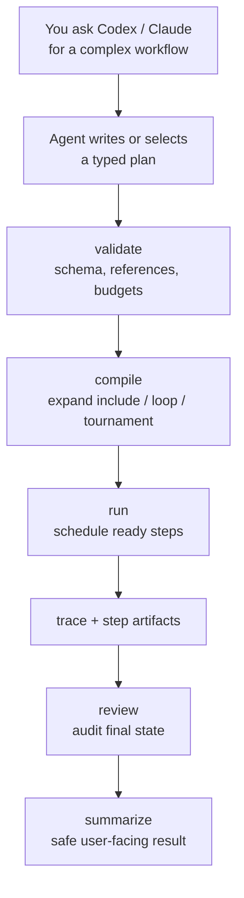

# Dynamic Workflow

Typed, auditable workflow execution for complex agent work.

Dynamic Workflow gives Codex or Claude a local workflow runtime for tasks that need explicit, reviewable steps. Instead of asking an agent to "remember the plan", the agent writes or selects a typed plan, validates it, compiles it into a dependency graph, runs it, and leaves durable evidence: manifest, trace, step artifacts, status, review, and summary.

Use it when a task is too large for one prompt and you want proof that every branch, loop, verification command, and final audit actually ran.

## When To Use It

Use Dynamic Workflow for:

- Multi-step implementation or review work that needs a real dependency graph.
- Fan-out review followed by synthesis.
- Conditional workflows, such as classify-and-act or skipped branches.
- Bounded repair loops.
- Candidate tournaments.
- Verification steps that must run shell commands and preserve results.
- Auditable experiments where you want `status`, `review`, and `summarize` after execution.

Do not use it for:

- One-off edits or quick questions.
- Work that cannot be expressed as explicit steps.
- Untrusted arbitrary JavaScript execution. The JS harness is compile/capture only in the MVP.
- External agent backends. The MVP backend is `current` only; explicit `codex`, `claude`, `acp`, or remote backend names fail closed.

## How It Works



The important rule: the typed plan is the contract. Prompt prose can explain intent, but the runtime only executes what validates and compiles.

## Install

If Dynamic Workflow is already installed as a Codex or Claude skill, skip to the quickstart. The agent will use the runtime commands behind the scenes.

If you are installing from this repository, the runtime needs Node.js 20 or newer and a local build:

```sh
npm install
npm run build
```

### Codex

Install the skill by symlinking or copying the skill directory after the local build exists:

```sh
mkdir -p ~/.codex/skills
ln -s /path/to/dynamic-workflow/skills/dynamic-workflow ~/.codex/skills/dynamic-workflow
```

For a one-way copy instead:

```sh
mkdir -p ~/.codex/skills
rm -rf ~/.codex/skills/dynamic-workflow
cp -R /path/to/dynamic-workflow/skills/dynamic-workflow ~/.codex/skills/dynamic-workflow
```

Restart Codex after installing or updating the skill.

### Claude

Claude users can install with the `.claude-plugin/` manifests when this repo is published through a Claude plugin flow. The distributed skill delegates to `bin/dw.mjs`; it does not contain a second runtime.

## Quickstart In Codex Or Claude

After installing the skill, use it the same way you use other agent skills: ask for Dynamic Workflow by name, or use one of the command prompts if your host exposes skill slash commands.

Slash commands may not appear when the host does not support skill-provided commands, when the skill was installed as a plain instruction-only directory, when the session was not restarted after install, or when the host only exposes skill invocation through natural language. In those cases, use the natural-language examples below; the agent follows the same workflow.

### Slash Command Flow

Use this when you want to review the plan before execution:

```text
/dw-plan Audit the auth and billing modules for risky data-access bugs.
Use fan-out reviewers, synthesize the findings, and add a final verify step.
```

Then run the approved plan. If the last validated plan is unambiguous, no path is needed:

```text
/dw-run
```

Inspect the result. If the latest run is unambiguous, no run id is needed:

```text
/dw-status
/dw-review
```

Resume if needed:

```text
/dw-resume
```

Use explicit paths or run ids only when there are multiple candidates:

```text
/dw-run .dynamic-workflow/plans/auth-billing-audit.yaml
/dw-review dwf_auth_billing_audit_mq123abc
```

### One-Step Plan And Run

`/dw-run <task>` is the one-step path. It plans, validates, compiles, runs, reviews, and summarizes in one flow:

```text
/dw-run Fix the flaky checkout total calculation.
Reproduce the failure, implement a focused fix, run the relevant test,
then run an adversarial review step before the final command.verify.
```

The command must complete this sequence in a single user operation: plan -> validate -> compile manifest/risk summary -> run -> status/review/summarize. If you want to approve the plan before execution, use `/dw-plan` first.

Natural-language equivalent:

```text
Use dynamic-workflow to fix the flaky checkout total calculation.
Plan: reproduce the failure, implement a focused fix, run the relevant test,
then run an adversarial review step before the final command.verify.
```

Good fit because the workflow has clear phases: reproduce, fix, verify, review.

### Example: Codebase Audit

```text
/dw-plan Review the API gateway, job worker, and database layer for race conditions.
Use three parallel reviewer steps, synthesize findings, then verify by running the test suite.
```

Good fit because fan-out reviewers can inspect different areas independently before a synthesis step removes duplicates.

### Example: Research Task

```text
/dw-run Compare three approaches for adding offline sync.
Generate candidate designs, run a tournament against correctness/risk/implementation cost,
then synthesize the recommended plan with tradeoffs and open questions.
```

Good fit because `workflow.tournament` records how candidates were compared instead of burying the decision in a single answer.

### Example: Larger Implementation

```text
/dw-run Migrate the notifications pipeline from polling to event-driven delivery.
Include classify-and-act for unknown risk areas, a bounded repair loop after review findings,
and command.verify steps for unit tests, integration tests, and lint.
```

Good fit because the workflow needs conditional branches, multiple verification gates, and durable status if the run is interrupted.

### Command Contract

For any of these requests, the agent must:

1. Resolve the package root.
2. Write or select a typed plan.
3. Run `validate`.
4. Run `compile` and show a concise manifest summary.
5. For `/dw-run <task>`, continue without another user command through `run`, `status`, `review`, and `summarize`.
6. Stop before execution only for `/dw-plan` or explicit plan-only requests.
7. Resolve omitted plan paths and run ids from recent context when unambiguous.
8. Ask one disambiguating question only when multiple recent plans or runs are plausible.

Successful runs print markers like:

```text
DW_RUN_START <run-id>
DW_STEP_START <step-id>
DW_STEP_VERIFY <step-id> succeeded
DW_STEP_DONE <step-id>
DW_REVIEW_START
DW_REVIEW_COMPLETE ok
DW_RUN_COMPLETE
```

## If You Want To Run The CLI Yourself

The skill uses the same CLI directly:

```sh
node bin/dw.mjs validate skills/dynamic-workflow/templates/plan.yaml
node bin/dw.mjs compile skills/dynamic-workflow/templates/plan.yaml
node bin/dw.mjs run skills/dynamic-workflow/templates/plan.yaml
node bin/dw.mjs status <run-id>
node bin/dw.mjs review <run-id>
node bin/dw.mjs summarize <run-id>
node bin/dw.mjs resume <run-id>
```

For throwaway experiments, isolate runtime output:

```sh
tmpdir=$(mktemp -d)
node bin/dw.mjs run my-plan.yaml --root "$tmpdir/runtime"
```

With `--root <dir>`, runs are written under `<dir>/runs/<run-id>/`. Without it, runtime artifacts default to `.dynamic-workflow/runs/<run-id>/`.

## Plan Shape

A minimal plan:

```yaml
schema_version: dynamic_workflow/run/v1
workflow_id: dwf_example
kind: mixed
steps:
  - step_id: implement
    type: agent.execute
    depends_on: []
    input:
      prompt: "Implement the requested change."

  - step_id: verify_commands
    type: command.verify
    depends_on: [implement]
    verify:
      commands:
        - npm test
```

Important fields:

- `step_id`: stable id used by dependencies and traces.
- `type`: registered step type, such as `agent.review`, `workflow.loop`, or `command.verify`.
- `depends_on`: explicit step dependencies.
- `run_if`: optional condition evaluated against a previous step's output object.
- `verify.commands`: canonical command list for `command.verify`.
- `permission_profile`: optional explicit profile; defaults come from the registry.
- `input.resource_scope`: optional lock scope used by conflict detection.

## Supported Workflow Modes

### Fan-out And Synthesize

Run independent review or generation branches, then merge:

```yaml
- step_id: review_gateway
  type: agent.review
  depends_on: []
- step_id: review_runtime
  type: agent.review
  depends_on: []
- step_id: synthesize
  type: agent.synthesize
  depends_on: [review_gateway, review_runtime]
```

### Adversarial Verification

Follow writer steps with read-only reviewers:

```yaml
- step_id: implement
  type: agent.execute
  depends_on: []
- step_id: adversarial_review
  type: agent.review
  depends_on: [implement]
```

### Classify And Act

Use `run_if` and `workflow.include` for conditional branches:

```yaml
- step_id: classify
  type: agent.classify
  depends_on: []

- step_id: feature_flow
  type: workflow.include
  depends_on: [classify]
  input:
    workflow_ref: builtin.feature
  run_if:
    step: classify
    output_path: label
    op: ==
    value: feature
```

`output_path` is relative to the step output object. For example, `output_path: status` reads the output status field.

### Tournament

Compare candidate steps with pairwise judges:

```yaml
- step_id: tournament
  type: workflow.tournament
  depends_on: [candidate_a, candidate_b, candidate_c]
  input:
    candidate_steps: [candidate_a, candidate_b, candidate_c]
    criteria: [correctness, risk, maintainability]
```

### Bounded Loop

Express iterative repair as bounded rounds:

```yaml
- step_id: repair_loop
  type: workflow.loop
  depends_on: [tournament]
  input:
    max_rounds: 2
    stop_condition: tests_pass
```

### Control Dependencies

Plan authors may depend on original control ids:

```yaml
- step_id: synthesize
  type: agent.synthesize
  depends_on: [repair_loop]
  run_if:
    step: repair_loop
    output_path: status
    op: ==
    value: succeeded
```

The compiler rewrites `repair_loop` to its terminal expanded node, such as `repair_loop__round_2`. The same applies to `workflow.include` and `workflow.tournament`. Compiled manifests fail closed if any `depends_on` or `run_if.step` references a missing node.

## JS Harness

The JS harness is a capture layer, not a Node sandbox. It turns supported SDK-looking calls into a typed plan; it does not execute arbitrary workflow JavaScript.

Supported capture primitives:

- `agent(...)`
- `parallel([...])`
- `loop(...)`
- `judge(...)`

Safety behavior:

- Comments and string literals are ignored by denied-capability scanning.
- Prompt text can mention words like `fs`, `fetch`, or `process.env` without being rejected.
- Executable code that references host capabilities is rejected, including `fs`, `child_process`, `process`, `fetch`, `import`, `require`, `eval`, `Function`, `globalThis`, and computed member access such as `obj["constructor"]`.
- Template expressions are rejected because they execute JavaScript.
- Sequential `agent()` calls after fan-out depend on the previous terminal step; synthesizer calls merge current terminal steps.

Prefer typed YAML/JSON plans for important work. Use the harness for controlled capture tests and ergonomic authoring experiments.

## Runtime Artifacts

A run writes:

```text
.dynamic-workflow/
└── runs/
    └── <run-id>/
        ├── plan.yaml
        ├── compiled_manifest.json
        ├── run.json
        ├── trace.jsonl
        ├── steps/
        │   └── <step-id>.json
        └── artifacts/
```

These files are evidence, not source code. Do not commit runtime artifacts. Ask the agent to use `--root <tmp>/runtime` when you want an isolated validation run.

## Current Coverage And MVP Limits

The current MVP has been exercised across:

- Fan-out plus synthesize.
- Adversarial review.
- `workflow.include` with `run_if` skip.
- `workflow.tournament` pairwise expansion.
- `workflow.loop` bounded rounds.
- Control dependency rewriting for `depends_on` and `run_if.step`.
- `command.verify` with canonical `verify.commands`.
- JS harness capture and denied-capability checks.
- CLI lifecycle: `validate`, `compile`, `run`, `status`, `review`, `summarize`, and `resume`.

Known limits:

- `agent.filter` is registered but not deeply exercised as a complex end-to-end pattern.
- `human.approval` can enter `waiting_user`, but a full human-resume workflow is future work.
- External backends are deliberately rejected.

## Version

Current: `0.1.0` MVP.

The source of truth is `package.json`.
